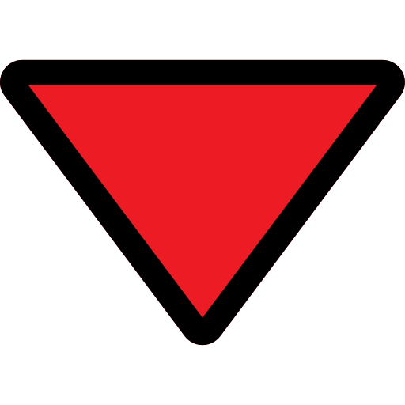

<table style="width:100%" align="center" border="0">
  <tr>
    <td width="30%" align="center">
        
    </td>
    <td><h1>🔺 Delaunator-RS 🔺</h1></td>
  </tr>
</table>

<p align="center">
  <strong>✨ An efficient implementation of the Delaunay triangulation algorithm in Rust, compiled to WebAssembly for use in browsers and Node.js. 🦀🕸️</strong>
</p>

<p align="center">
  <a href="https://opensource.org/licenses/ISC">
    
  </a>
  
  
  
  
  <a href="https://github.com/gabrielmaialva33/delaunator-rs/commits/master">
    
  </a>
  
</p>

---

## 🌟 Key Features

- ⚡ **High Performance**: Optimized Rust implementation offering superior speed compared to pure JS implementations.
- 🧩 **WebAssembly**: Compiled to WebAssembly (WASM), allowing use in any modern browser and Node.js.
- 🔄 **Compatible API**: Interface similar to the original [Delaunator](https://github.com/mapbox/delaunator) library for easy migration.
- 🛡️ **Robustness**: Stable algorithm resistant to edge cases and collinear points.
- 📊 **Interactive Visualization**: Included interactive web demo for easy experimentation.
- 🖱️ **Multiple Demo Modes**: Includes mouse-following mode and animations for visual demonstrations.

---

## 📦 Installation & Setup

### Prerequisites

- Rust and Cargo (install via [rustup](https://rustup.rs/))
- wasm-pack (install with `cargo install wasm-pack`)

### 1. Via NPM (for JavaScript/TypeScript projects)

```bash
npm install delaunator-rs
````

### 2\. Manual Compilation from Source Code

```bash
# 1. Clone the repository
git clone [https://github.com/gabrielmaialva33/delaunator-rs.git](https://github.com/gabrielmaialva33/delaunator-rs.git)
cd delaunator-rs

# 2. Compile to WebAssembly
./build.sh

# 3. (Optional) Start a local server for the demo
python3 -m http.server --directory www
# Access http://localhost:8000 in your browser
```

-----

## 🚀 How to Use

### In JavaScript/TypeScript (via Module)

```javascript
import initDelaunator from 'delaunator-rs';

async function runTriangulation() {
  // Initialize the WASM module
  const delaunatorModule = await initDelaunator();

  // 1. Prepare your points: Array of arrays [x, y]
  const points = [[0, 0], [1, 0], [0, 1], [1, 1]];

  // 2. Create the triangulation
  const delaunay = delaunatorModule.from(points);

  // 3. Access the results
  console.log('Triangle Indices:', delaunay.get_triangles()); // Uint32Array [0, 2, 1, 2, 3, 1] (example)
  console.log('Convex Hull:', delaunay.get_hull());      // Uint32Array [0, 1, 3, 2] (example)

  // Remember to free memory if needed (in more complex scenarios)
  // delaunay.free(); // (if the API exposes a free method)
}

runTriangulation();
```

### Using Custom Objects with Accessors

```javascript
async function runWithCustomObjects() {
  const delaunatorModule = await initDelaunator();

  // Your points as objects with custom coordinates
  const locations = [
    { id: 'A', lng: 10.1, lat: 50.2 },
    { id: 'B', lng: 11.3, lat: 51.4 },
    // ... more locations
  ];

  // Create the triangulation specifying how to get X and Y
  const delaunay = delaunatorModule.from(
    locations,
    loc => loc.lng,  // Function to get the X coordinate
    loc => loc.lat   // Function to get the Y coordinate
  );

  console.log('Triangles (objects):', delaunay.get_triangles());
  console.log('Hull (objects):', delaunay.get_hull());
}

runWithCustomObjects();
```

### Advanced API (Flat Array and Update)

```javascript
async function runAdvanced() {
  const delaunatorModule = await initDelaunator();

  // Create from a flat array of coordinates [x0, y0, x1, y1, ...]
  const coords = new Float64Array([0, 0, 1, 0, 0, 1, 1, 1]);
  const delaunay = new delaunatorModule.Delaunator(coords); // Use the constructor directly

  // Initial results
  console.log('Triangles (flat array):', delaunay.get_triangles());

  // Modify the points in the 'coords' array if needed...
  // coords[0] = 0.5; coords[1] = 0.5;

  // Update the triangulation (if points were modified in-place)
  // delaunay.update(); // Call update() to recalculate
  // console.log('Updated Triangles:', delaunay.get_triangles());
}

runAdvanced();
```

-----

## 📊 Interactive Demo

The included web demo (`www/index.html`) allows you to:

- ✅ Add points by clicking on the canvas.
- ✨ Add random points.
- 👁️ Visualize the triangulation in real-time.
- 🖱️ Use the "follow mouse" mode for dynamic visualization.
- 🎬 Use animation mode for demonstrations.
- ⚫ Adjust the size of the points.
- 🎨 Supports light/dark theme.

**To run the demo:**

```bash
# Make sure you have compiled with ./build.sh
python3 -m http.server --directory www
```

Access `http://localhost:8000` in your browser.

-----

## 📐 About Delaunay Triangulation

Delaunay triangulation is a fundamental technique in computational geometry that partitions a set of points in a plane into triangles. It has unique properties:

- **Empty Circumcircle**: No point in the set is inside the circumcircle of any triangle in the triangulation.
- **Maximizes Minimum Angle**: It tends to avoid excessively "thin" or "flat" triangles by maximizing the smallest internal angle among all triangles.
- **Duality with Voronoi**: It is the dual graph of the Voronoi Diagram for the same set of points.

**Common applications:**

- Mesh generation for finite element simulations.
- Terrain and surface modeling (TINs - Triangulated Irregular Networks).
- Scientific data visualization.
- Graphics and animations in games.
- 3D reconstruction from point clouds.

-----

## 📚 Project Structure

```
delaunator-rs/
├── src/                 # Rust source code
│   ├── lib.rs           # Main triangulation implementation
│   ├── utils.rs         # Utilities (e.g., console_log for WASM)
│   └── wasm.js          # JS glue code for WASM integration (if any)
├── www/                 # Web demo application
│   ├── index.html       # Demo interface
│   └── pkg/             # Compiled WebAssembly files (generated by build.sh)
├── .github/             # GitHub files (workflows, assets, etc.) - Optional
│   └── assets/          # Contains assets like images
│       └── down.png     # The logo image
├── build.sh             # Script to compile WASM and prepare the demo
├── Cargo.toml           # Rust project configuration (dependencies, metadata)
└── README.md            # This file
```

*(Note: Added image path clarification to Project Structure)*

-----

## 🛠️ Performance

Preliminary benchmarks demonstrate excellent performance of the WASM version compared to pure JavaScript implementations:

| \# Points   | Pure JavaScript (Delaunator) | Delaunator-RS (WASM) | Speedup (Approx.) |
|------------|------------------------------|----------------------|-------------------|
| 100        | \~1.5ms                       | \~0.3ms               | \~5x               |
| 1,000      | \~12ms                        | \~2.6ms               | \~4.6x             |
| 10,000     | \~150ms                       | \~32ms                | \~4.7x             |
| *100,000* | *\~1.8s* | *\~350ms* | *\~5.1x* |

*\*Results based on an average of 10 runs on a MacBook Pro (M1) with Chrome 110+.*
*\*Values are approximate and may vary significantly depending on the machine and browser.*

-----

## 🤝 Contributing

Contributions are very welcome\! Feel free to:

1.  🐛 Open **Issues** to report bugs or problems.
2.  💡 Suggest new features or improvements.
3.  🚀 Submit **Pull Requests** with fixes or new implementations.

-----

## 🙏 Acknowledgements

Special thanks to the **Mapbox** team for their original work on the [Delaunator](https://github.com/mapbox/delaunator) library in JavaScript, which served as a great inspiration and API reference for this Rust/WASM implementation.

-----

## 📜 License

This project is licensed under the [ISC License](https://www.google.com/search?q=LICENSE) (equivalent to a simplified MIT license).

-----

## 📧 Support & Contact

- **Issues or Questions?** Open an [Issue on GitHub](https://www.google.com/search?q=https://github.com/gabrielmaialva33/delaunator-rs/issues).
- **Author:** Gabriel Maia - [GitHub Profile](https://github.com/gabrielmaialva33)

-----

\<p align="center"\>
Made with ❤️ in Rust and WebAssembly 🦀🕸️
\</p\>